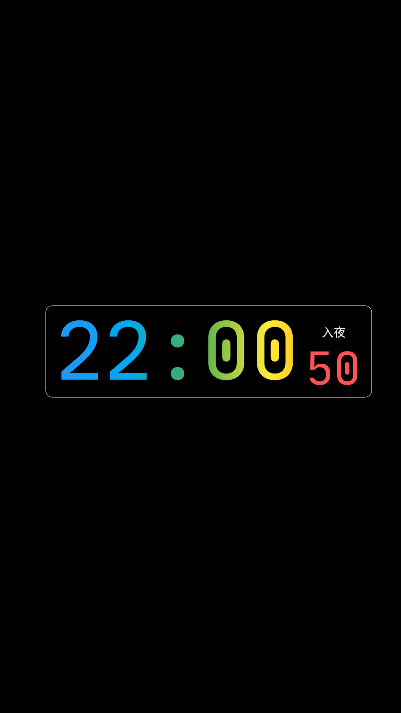
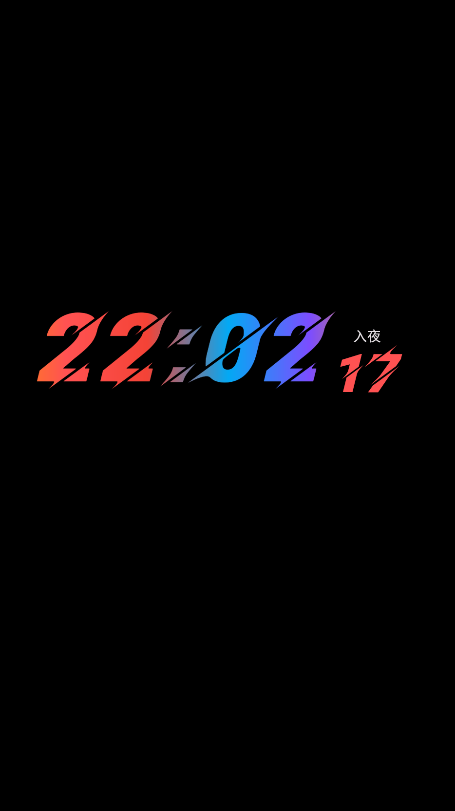
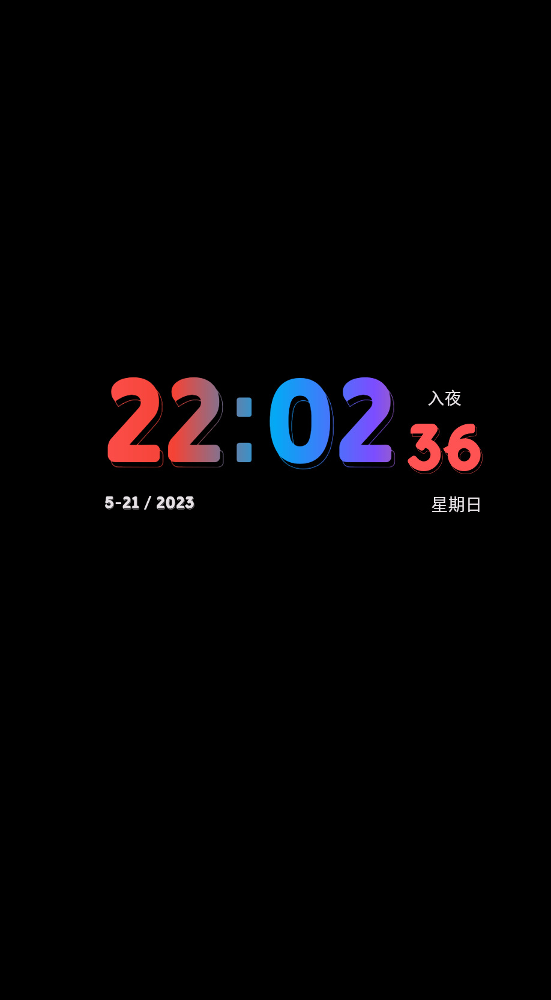
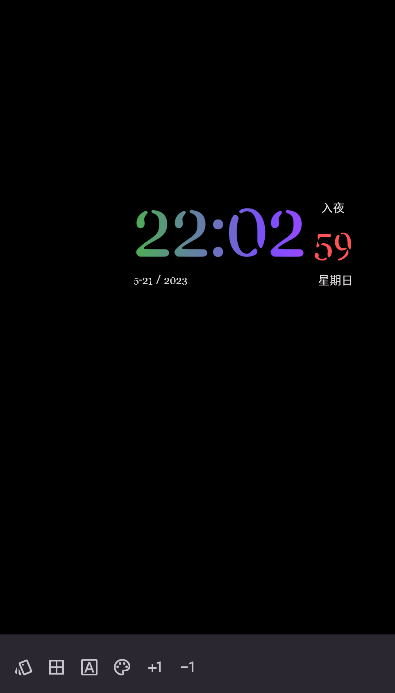

# Funny Time App

一个全屏显示的时间软件，类似于 always on display (AOD, 持久显示) 的效果。  
非常适合 OLED、Amoled 屏幕常亮使用。  
使用 Flutter 技术开发，理论上支持全平台(Web、Android、iOS等)，Web、iOS 已测试。  

A full-screen time display software, similar to the effect of always on display (AOD).  
It is especially suitable for OLED and Amoled screens to be always on.  
Developed using Flutter technology, theoretically supporting all platforms (Web, Android, iOS, etc.), and Web and iOS have been tested.  

## Usage 

打开 App, 会默认全屏显示一个时间组件，屏幕背景为全黑（#FF000000）。  
时间组件会随着时间做微小的移动以防止长时间显示导致的“烧屏”。   
点击时间组件，底部会显示一排设置工具栏，点击相应图标即可调整组件的外观，再次点击时间组件会隐藏设置工具栏。  

[查看App截图 ](#screenshot)  

When you open the app, a time component will be displayed in full screen by default, and the screen background will be all black (#FF000000).  
The time component will make small movements with time to prevent "burn-in" caused by long-term display.  
Clicking on the time component will display a row of setting toolbars at the bottom. Clicking the corresponding icon will adjust the appearance of the component. Clicking the time component again will hide the setting toolbar.   

## Build

本地搭建 Flutter 开发环境，[flutter](https://flutter.dev)  
然后在本项目打开命令行窗口，执行下面命令即可构建。（可能需要选择构建平台，根据需要配置选择即可）

``` bash
flutter upgarde 
flutter pub get 
flutter run --release
```

## Develop 

本项目理论上支持多平台，开发时可以使用 Web 平台调试。  

The project theoretically supports multiple platforms, and the Web platform can be used for debugging during development.  

```bash
# Choose Web (Chrome Or Edge)
flutter run 
```

## Issue 

项目为自用软件开源，目前仅满足自己的需求。如果你使用中发现 Bug 或者有好的改进建议,  
[欢迎提出 Issue](https://github.com/dengsgo/funny_time/issues) .   

The project is an open-source software for personal use, currently only meeting one's own needs. If you find any bugs or have good suggestions for improvement during use, please feel free to create an issue.  

## Donation

开源不易，纯属用爱发电。如果本软件对你有帮助，可以扫码请作者喝一杯咖啡。  

If this software is helpful to you, you can scan the code and buy the author a cup of coffee as a way of showing your appreciation.  

| 微信                                                        | 支付宝                                                        |
|-----------------------------------------------------------|------------------------------------------------------------|
|  |  |


## Screenshot

### 屏显 

  
  

  
<br/>

### 工具栏

  
  
  
  

<br/>

### 字体样式


